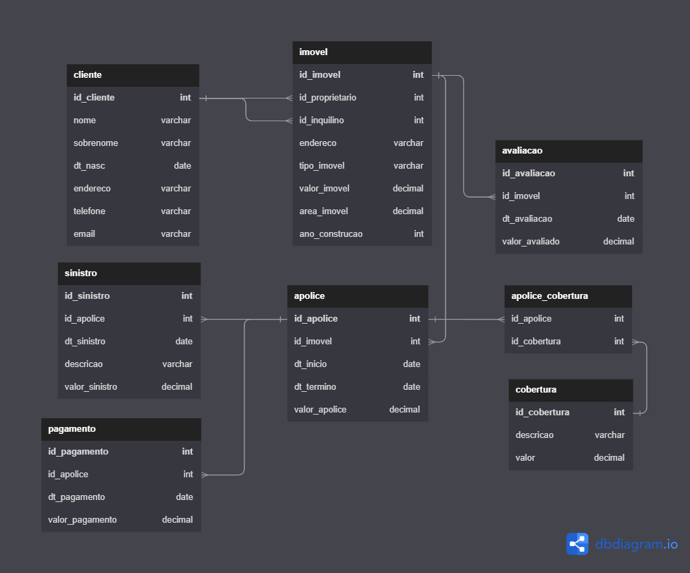

## Projeto Sistema de Seguradora de Imóveis

### Grupo C

### Integrantes:
- @angelum23
- @higorgoulart
- @guilherme-savio
- @SofiaMartinslv
- @Bruno-Venturini
- @dufrtss
- @GabrielGuinzani
- @guga2905

### Modelo Físico:
Utilizado https://dbdiagram.io/

    

 
 
    <a href="https://github.com/guilherme-savio/SeguroImoveis/blob/main/dicionario_dados/dicionario.xlsx">
    <h3>
        Dicionário de Dados
    </h3>
   </a>

### Scripts DDL Criação do Database:
Banco de dados utilizado SQL Server versão 2022 - Azure. 
<code>1 arquivo SQL por objeto</code>

### Scripts Popula tabelas:
Banco de dados utilizado SQL Server versão 2022 - Azure. 
<code>1 arquivo SQL por objeto</code>

### Objetos de BD (stored procedure, triggers e functions):
<code>1 arquivo SQL por objeto</code>
  
### Código do sistema: 
Linguagem de Programação C# .NET Windows Forms. 
<code>código fonte da aplicação</code>
